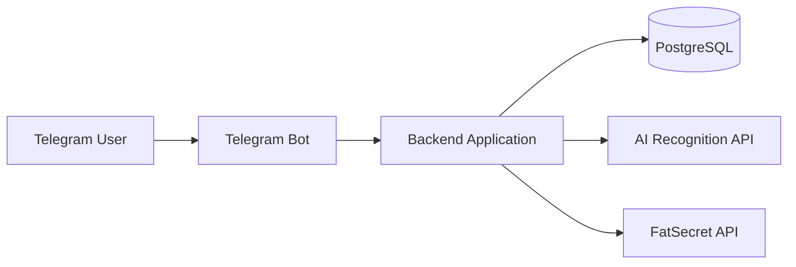
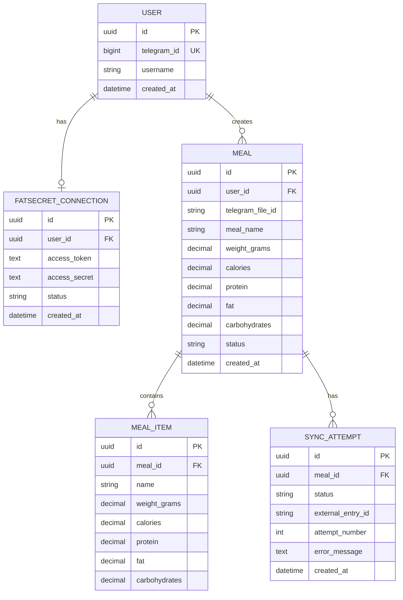
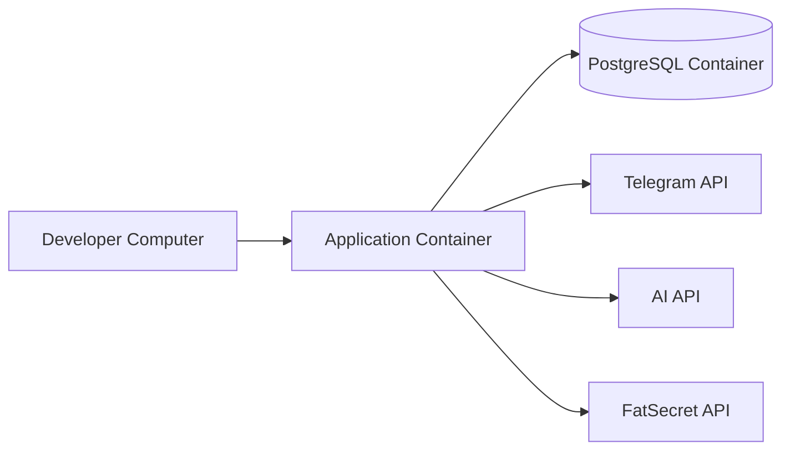

# Technical Architecture

## 1. System Overview

The service is a Telegram bot that recognizes food from a photo, estimates calories and macros, and saves the confirmed meal to FatSecret.

Main flow:

1. The user connects a FatSecret account.
2. The user sends a meal photo.
3. The backend sends the photo to an AI service.
4. The AI service returns the meal name, weight, calories, protein, fat, and carbohydrates.
5. The bot shows the result to the user.
6. The user confirms or edits the result.
7. The backend saves the meal to FatSecret.

The first version will use a simple modular monolith architecture.



---

## 2. System Components

### Telegram Bot

The Telegram bot is the user interface.

It:

* receives commands and meal photos;
* shows recognition results;
* allows the user to confirm or edit the meal;
* shows authorization and synchronization errors.

### Backend Application

The backend contains the main application logic.

It:

* manages users;
* downloads photos from Telegram;
* sends photos to the AI service;
* validates AI responses;
* stores meal data;
* connects users to FatSecret;
* sends confirmed meals to FatSecret.

### Database

The database stores:

* Telegram users;
* FatSecret connection data;
* meal recognition results;
* synchronization status.

### AI Recognition Service

The AI service analyzes the meal photo and returns estimated food information and macros.

The AI result is only an estimate. The user must confirm it before synchronization.

### FatSecret Integration

The FatSecret integration:

* authorizes the user;
* stores access tokens;
* sends confirmed meal data to the user's food diary.

---

## 3. ER Diagram



Possible meal statuses:

```text
processing
waiting_for_confirmation
confirmed
recognition_failed
sync_failed
synced
cancelled
```

---

## 4. Integrations

### Telegram Bot API

Used to:

* receive messages and photos;
* download meal images;
* send messages and buttons.

### AI Recognition API

Used to analyze a photo and return structured data:

```json
{
  "meal_name": "Chicken with rice",
  "items": [
    {
      "name": "Chicken breast",
      "weight_grams": 150,
      "calories": 248,
      "protein": 46.5,
      "fat": 5.4,
      "carbohydrates": 0
    }
  ]
}
```

The backend must validate the response before saving it.

### FatSecret API

Used to:

* authorize the user;
* connect the FatSecret account;
* add confirmed meals to the food diary.

---

## 5. Tech Stack

Proposed MVP stack:

* **Python** — backend language;
* **aiogram** — Telegram bot framework;
* **FastAPI** — FatSecret callback and health endpoint;
* **PostgreSQL** — database;
* **SQLAlchemy** — database access;
* **Alembic** — database migrations;
* **Pydantic** — data validation;
* **httpx** — external API requests;
* **pytest** — tests;
* **Docker Compose** — local development.

The exact AI provider will be selected separately.

---

## 6. Error Handling

The application should handle these main errors:

### Invalid user input

Examples:

* message without a photo;
* unsupported file;
* invalid edited values.

The bot should explain the problem and allow the user to try again.

### AI errors

Examples:

* request timeout;
* invalid response;
* food was not recognized;
* API rate limit.

The meal should receive the `recognition_failed` status.

### FatSecret errors

Examples:

* authorization failed;
* token is invalid;
* API is unavailable;
* synchronization request failed.

Temporary errors may be retried several times. Each attempt should be stored in the database.

The system must prevent the same meal from being added to FatSecret more than once.

---

## 7. Security

The application must not store secrets in the source code.

Secrets should be stored in environment variables:

```text
TELEGRAM_BOT_TOKEN
FATSECRET_CONSUMER_KEY
FATSECRET_CONSUMER_SECRET
AI_API_KEY
DATABASE_URL
TOKEN_ENCRYPTION_KEY
```

Security rules:

* do not commit the `.env` file;
* do not log API keys or access tokens;
* encrypt FatSecret tokens in the database;
* never ask users to send their FatSecret password to the bot;
* check that every meal belongs to the current Telegram user;
* validate all data from users and external APIs;
* delete temporary image files after processing.

---

## 8. Deployment

For local development, Docker Compose will run:

```text
Application
PostgreSQL
```



For the MVP, the production version may run on one VPS or container hosting platform.

Production requires:

* one application container;
* PostgreSQL;
* environment variables;
* HTTPS for callback endpoints;
* application logs;
* database migrations.

A simple health endpoint can be used:

```text
GET /health
```

The MVP does not require microservices, Kubernetes, message queues, or complex monitoring.
